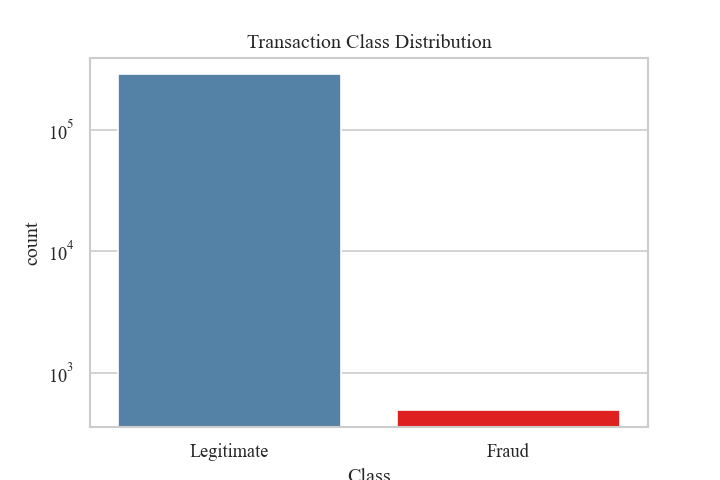
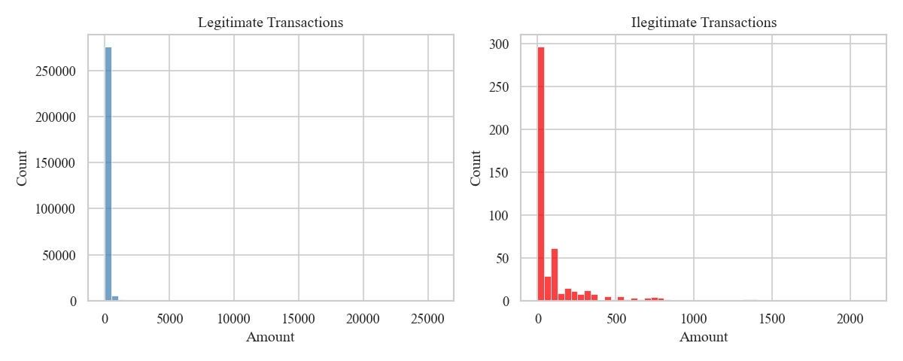
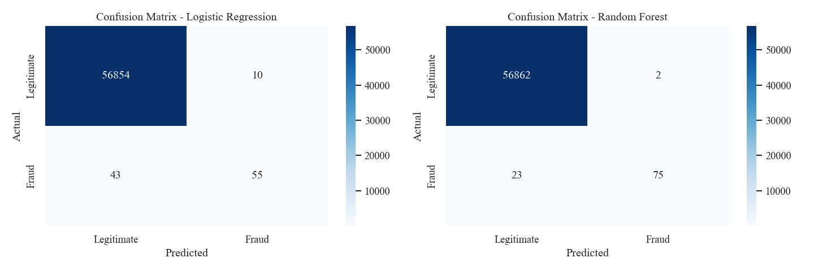

# 💳 Credit Card Fraud Detector

Machine learning model to detect fraudulent credit card transactions, deployed as an interactive web app with Streamlit.

---

## 🌐 Live Demo

Run locally with: streamlit run app.py
Load a random transaction, analyze it with the model, and reveal if it's fraudulent or legitimate.

---

## 🔌 API Endpoint

The model is also available as a REST API built with FastAPI.

**Run the API:**
uvicorn main:app --reload

**Predict endpoint:**
POST http://localhost:8000/predict

**Example request:**
```json
{
  "Time": 0, "Amount": 149.62,
  "V1": -1.35, "V2": -0.07, "V3": 2.53,
  "V4": 1.37, "V5": -0.33, "V6": 0.46,
  "V7": 0.23, "V8": 0.09, "V9": 0.36,
  "V10": 0.09, "V11": -0.55, "V12": -0.61,
  "V13": -0.99, "V14": -0.31, "V15": 1.46,
  "V16": -0.47, "V17": 0.20, "V18": 0.02,
  "V19": 0.40, "V20": 0.25, "V21": -0.01,
  "V22": 0.27, "V23": -0.11, "V24": 0.06,
  "V25": 0.12, "V26": -0.18, "V27": 0.13,
  "V28": -0.02
}
```

**Example response:**
```json
{
  "prediction": "LEGITIMATE",
  "confidence": 100.0,
  "fraud_probability": 0.0
}
```

Interactive API docs available at: `http://localhost:8000/docs`


## 📊 Overview

This project builds and compares two classification models to detect fraudulent transactions from 284,807 real credit card transactions, where only 0.17% are fraudulent.

**Key findings:**
- Fraudulent transactions tend to have lower amounts (max ~2,000€ vs ~25,000€ for legitimate)
- Random Forest outperforms Logistic Regression in all metrics
- Random Forest detects 77% of frauds with 97% precision
- Only 2 false alarms out of 56,962 test transactions

---

## 🛠️ Tech Stack

- **Python 3**
- **Pandas / NumPy** — data manipulation
- **Matplotlib / Seaborn** — visualizations
- **Scikit-learn** — machine learning models and evaluation
- **Streamlit** — interactive web app
- **FastAPI** — REST API for model serving

---

## 📁 Project Structure
credit-card-fraud-detection/
├── app.py                      # Streamlit web app
├── fraud_detection.ipynb       # Analysis notebook
├── outputs/                    # Generated visualizations
│   ├── 01_class_distribution.png
│   ├── 02_amount_distribution.png
│   └── 03_confusion_matrix.png
└── README.md
---

## 📈 Visualizations

### Class Distribution


### Amount Distribution — Fraud vs Legitimate


### Confusion Matrix Comparison


---

## 📉 Model Comparison

| Metric | Logistic Regression | Random Forest |
|--------|-------------------|---------------|
| Precision (Fraud) | 85% | **97%** |
| Recall (Fraud) | 56% | **77%** |
| F1-score (Fraud) | 0.67 | **0.86** |
| False Alarms | 10 | **2** |

---

## ⚠️ Disclaimer

This model detects 77% of fraudulent transactions. All flagged transactions should be reviewed by a human analyst before taking action. No model is 100% accurate — false positives and false negatives are expected.

---

## 🚀 How to Run

1. Download the [Credit Card Fraud Detection dataset](https://www.kaggle.com/datasets/mlg-ulb/creditcardfraud)
2. Place `creditcard.csv` in the project folder
3. Install dependencies: pip install pandas numpy matplotlib seaborn scikit-learn streamlit
4. Run the web app: streamlit run app.py
5. Run the API: uvicorn main:app --reload
---

## 📌 Dataset

This project uses the [Credit Card Fraud Detection dataset](https://www.kaggle.com/datasets/mlg-ulb/creditcardfraud) from Kaggle. The raw data file is not included in this repository.

---

## 👤 Author

**Vicente Sánchez Reza**
[github.com/vicentszr](https://github.com/vicentszr)
